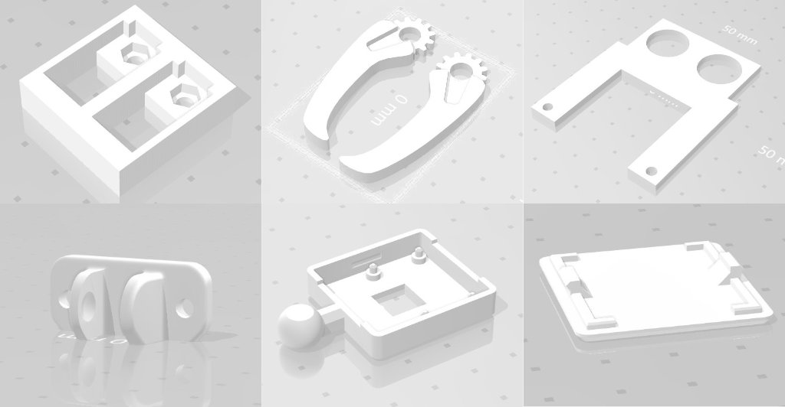
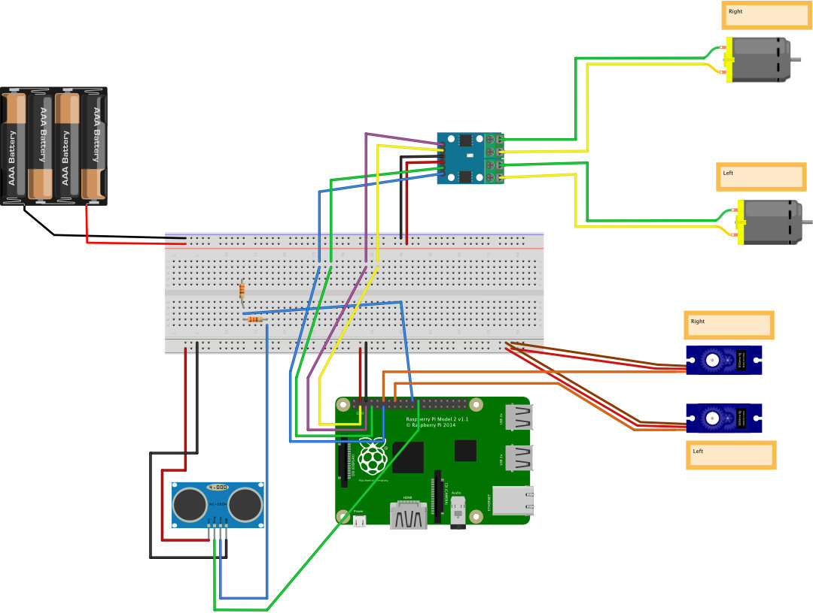
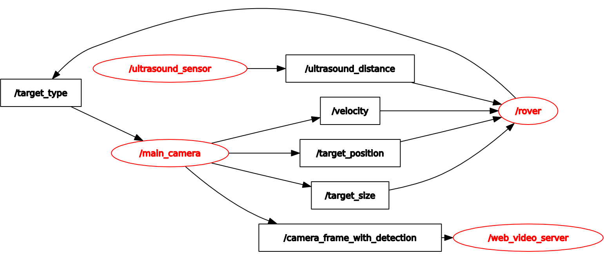
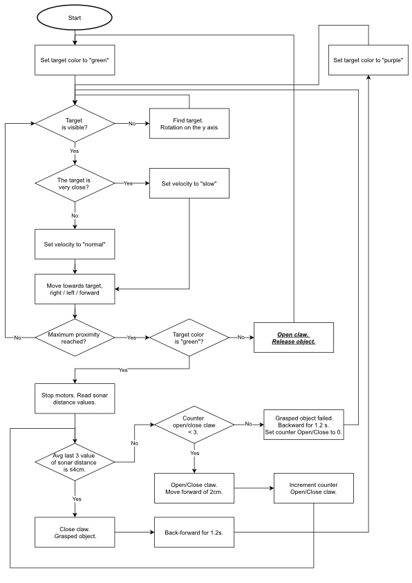
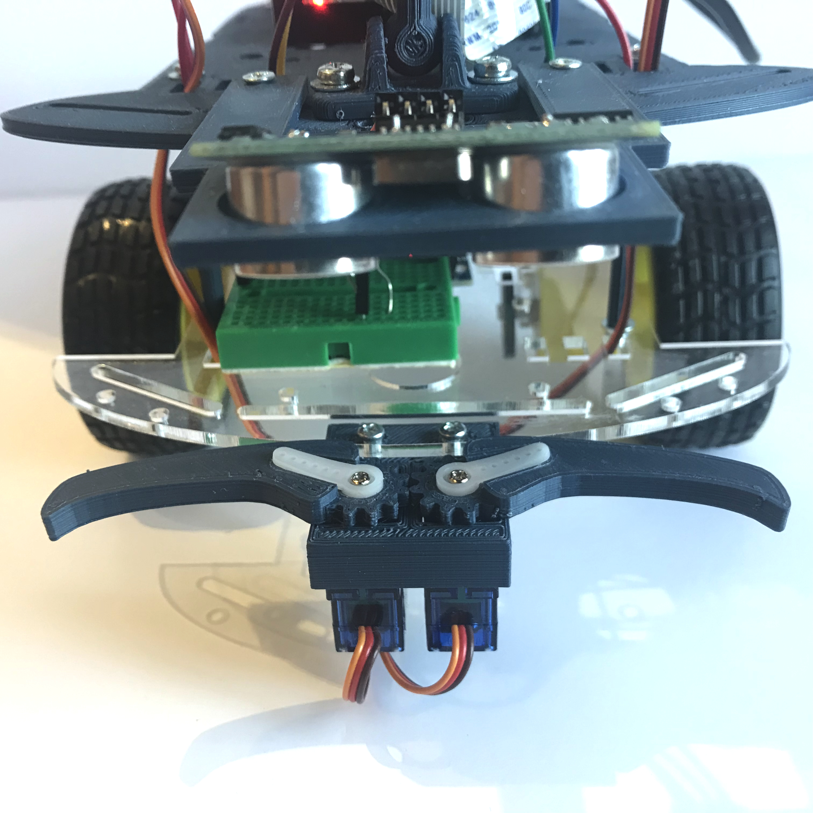

# 🤖 Rover 2WD with Claw

https://user-images.githubusercontent.com/3593408/162613965-942c843a-1525-401f-8784-cbd158f66db2.mov

This page shows the main aspects of the robot. The robot use Robot Operating System (ROS) runned on the RaspberryPi 2 Model B. The main goal of the robot is to grab, with a claw, a small object positioned in front an wall with green background and relase it in front an another wall with purple background. The project is created for fun 🤓.

## Goal and Environment
The task of this robot is very simple: first of all go to the first target, next grab the object positioned in front on it, than find the second target and finally release the object in front of this.
The environment it with run the task is composed by three element: a green wall, with size 10.5 × 30 cm, a purple wall, with size of 21 × 30 cm and the small cylinder object, with size of 6 × 8 cm.

## Hardware
- Raspberry Pi 2 Model B
- Rapberry Pi Camera v1.3
- TP-Link Wireless T2U Nano
- Motors servo SG90 (x2)
- DC Motrs (x2)
- Bridge-H L9110S
- HC-SR04
- 330 Ohm resistor (x2)
- Rover base kit

## 3D Printed objects
- Claw and Servo box
- Ultrasound sensor support
- Chassis second floor and supports
- [Raspberry Pi Camera support](https://www.thingiverse.com/thing:2746186)

## Connections
I have used the tool called [Fritzing](https://fritzing.org) for design the rover’s connections. In the design is not present the Pi Camera, because Friting doesn’t support this type of connection.

## Software (ROS and Topics)
The core of the robot is a RaspberryPi 2 Model B with Ubuntu 18.16 LTS operation system. The version of ROS chosed is Noetic Ninjemys (ROS 1 LTS). This version is the most recent of ROS with native support to ARM processor with 32-bit.

I use a five topics, showed in the following graph, for manage all aspect of rover. The sixth topic, "/camera_frame_with_detection" is only for debug use, it shows the frame edit published from "/main_camera".

## Flowchart of Rover

## 📷 Images

